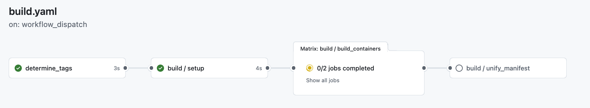

# Multiplatform (amd64/arm64) builds for SQuaRE services

```{abstract}
Using ARM rather than AMD/Intel processors at Google IDF is somewhat less expensive (and massively less power hungry) for similar performance.  Therefore we want to be able to run our entire RSP workload, if possible, on ARM.  This technote describes the tooling required to make that happen efficiently and inexpensively.
```

## Impetus

We wanted to be able to run as much RSP workload as possible (ideally, all of it) on `arm64` rather than `amd64` architecture, in order to take advantage of the power efficiency of ARM.

This would require rebuilding our containers for the `linux/arm64` platform as well as the default `linux/amd64`.

Our existing composite actions, e.g. [build-and-push-to-ghcr](https://github.com/lsst-sqre/build-and-push-to-ghcr), are already capable of doing this by specifying the input parameter `platform` with a list of target platforms, but there are a problem and an annoyance with this.

The annoyance is that adding `arm64` takes about four times as long as just `amd64`, because nothing is parallelized.
For each `Dockerfile` step, first one architecture, then the next (and, were we doing broader multiplatform builds, and so on for each one) runs sequentially.
Even worse, everything but `amd64` is virtualized with [QEMU](https://www.qemu.org/).
In practice, the emulation penalty for `arm64` on `amd64` seems to be about a factor of three.

The problem is that this approach will not work for the [sciplat-lab](https://github.com/lsst-sqre/sciplat-lab) build.
Quite simply, `sciplat-lab` is too large (13.3GB for each architecture), and the GitHub runner runs out of disk space while trying to assemble the layers of the resulting image.
It is also too large to put in the GitHub cache (maximum of 10GB) so we could not store the architecture-specific containers in cache as we moved from `job` to `job` within the GitHub Action.

We had initially thought we would need to use GitHub Large Runners (and if the DM stack keeps growing, we may yet), but we found some space savings: first, we correctly stripped out unnecessary content from the stack installation, and second, we replaced a Playwright-and-Chromium PDF export software stack with a TexLive-and-LaTeX PDF export stack.

Nevertheless, we still couldn't cram both architectures' images onto a single standard runner.

## Insight

Dan Fuchs pointed out that GitHub offered [ARM runners for free ](https://github.blog/changelog/2025-01-16-linux-arm64-hosted-runners-now-available-for-free-in-public-repositories-public-preview/).

Given that we'd started using matrixed `job`s in nublado to build several containers in parallel, and given that we could use a dynamic value (reflecting the platform architecture) for `runs-on` in a GitHub Actions `job`, we realized that we could in fact run our `arm64` and `amd64` builds in parallel within a matrix.

## Implementation

[Docker Manifest](https://docs.docker.com/reference/cli/docker/manifest/) provides a mechanism to allow the user to assemble multiple containers (e.g. an `amd64` version and an `arm64` version) into a single Docker manifest, and the Docker component doing the image pull will be able to retrieve just the architecture-appropriate layers when constructing an image to run on a given host.
This stage requires some time to run, but it is still much cheaper than doing a `docker pull` and then retagging, because it uses `HTTP HEAD` commands to get the SHA-256 digest for each layer included in the manifest, and does not need to transfer the layer contents.

The plan, therefore, was to structure the workflow like this .
The two build stages (one per architecture) happen in parallel, and the manifest is assembled only once each is built.

### Multi-registry pushes

Some containers (notably sciplat-lab and its init containers) need to be hosted at Google Artifact Registry as well as at GitHub Container Registry in order to not rate-limit container pulls under heavy load.

For that reason, we could not use the existing `build-and-push-to...` actions we already had.
For everything except `sciplat-lab` we could probably have finessed it, in that we could use the GitHub Cache to get from building each architecture's container to the step where we assembled those containers under a single manifest.
In that case we could have avoided rebuilding the container, because when we did a second build for a target at a different registry, each layer would have been found in our build cache already.
This would, however, not work for the very large `sciplat-lab`.

Therefore, we wrote a generalized `build-and-push` action `step`.
[This composite GitHub Action](https://github.com/lsst-sqre/multi-registry-login) takes an image specification (that is, a registry host and a path specifying the repository for images, e.g. `https://ghcr.io/lsst-sqre/nublado-purger`), which may be a comma-separated list of image specifications.
It recognizes Docker Hub, GitHub Container Registry, and Google Artifact Registry from each image specification, and logs into each one as appropriate.
This then lets us do a single build, tagged with multiple registries, and push to them as part of the `docker buildx build` stage (the `output` target `registry` implies doing the image push).

That composite action isn't all that useful on its own.
However, when paired with a matrixed build, it means that we can build artifacts for each of up to three registries (we could add additional registries if and when requested; we just need to know the host, the username to use at that host, and the name of the GitHub secret that holds the authentication credential for that host).

This then required the creation of a GitHub Reusable Workflow, [multiplatform-build-and-push](https://github.com/lsst-sqre/multiplatform-build-and-push).
This had to be a Reusable Workflow, rather than a Composite Action, because it contains the matrixed, parallelized builds, and therefore must be invoked as a `job` rather than a `step` within a `job`.

It just uses `docker buildx` with tags for multiple registries, and the `docker buildx build` stage handles the pushes.

### Manipulating Image Tags

One thing that is not apparent but is a consequence of the matrixed, parallelized approach plus the `docker manifest` step, is that we are now creating three times as many tags.
For each tag we really want (e.g. `tickets-DM-52589`), we create (in the matrixed build step) both `tickets-DM-52589-amd64` and `tickets-DM-52589-arm64` and push those to the registry.
The `tickets-DM-52589` tag is created by the `docker manifest` step that stitches together the two architecture-specific tags into a generic tag.

This required some work in [Nublado](https://github.com/lsst-sqre/nublado) in order to hide the architecture-specific tags from the JupyterHub spawner menu.

## Instantiation

In practice, replacing existing build-and-push actions is simple.
The developer simply finds the `build` `job` and replaces it with:

```yaml
  build:
    uses: lsst-sqre/multiplatform-build-and-push/.github/workflows/build.yaml@v1
    needs: [test]
    with:
      image: ghcr.io/${{ github.repository }}
    secrets: inherit
    # Only do Docker builds of tagged releases and pull requests from ticket
    # branches. This will still trigger on pull requests from untrusted
    # repositories whose branch names match our tickets/* branch convention,
    # but in this case the build will fail with an error since the secret
    # won't be set.
    if: >
      github.event_name != 'merge_group'
      && (startsWith(github.ref, 'refs/tags/')
          || startsWith(github.head_ref, 'tickets/')
          || startsWith(github.head_ref, 't/') )
```

The only real differences from `build-and-push-to-ghcr` are:
* The developer does not pass the GitHub Token directly, instead using `secrets: inherit`.
  This is necessary because the image might be pushed to multiple registries.
* The developer needs to specify the registry host before the repository; usually this will be `ghcr.io`.
If multiple registry hosts are needed, that is done by making the image string a comma-separated list, e.g `ghcr.io/${github.repository},us-central1.docker.pkg.dev/us-central1-docker.pkg.dev
/rubin-shared-services-71ec/sciplat/${env.repo_name}` (where `repo_name` would have been set up to be the last component of `${github.repository}`, which, weirdly, is not exposed on its own via the `github` action context.

## Impressive!

With these changes in place, we can create multiplatform builds that do not take substantially more time than single-platform builds, and also push them to multiple registries if we so desire.
The only additional work required on the part of the developer to adopt the Github Reusable Workflow is to specify the registry as part of the image specification.
